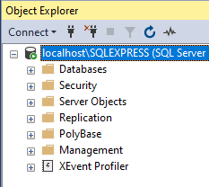
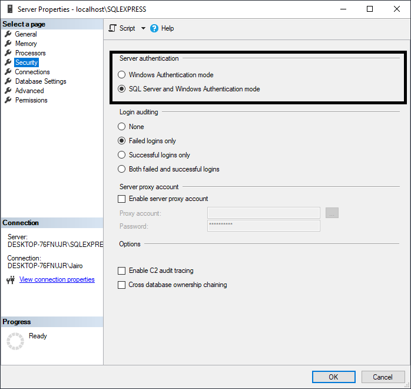
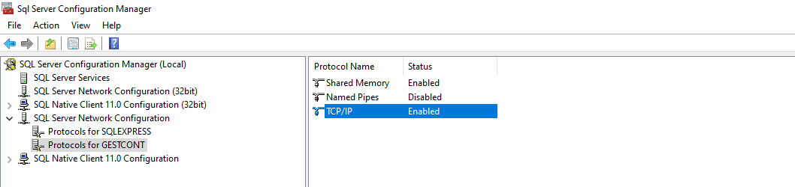
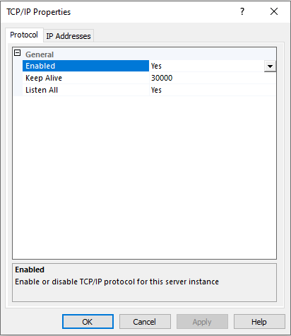
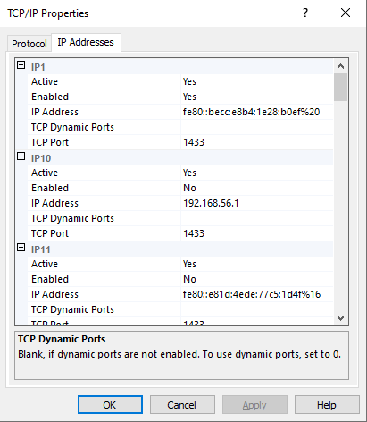
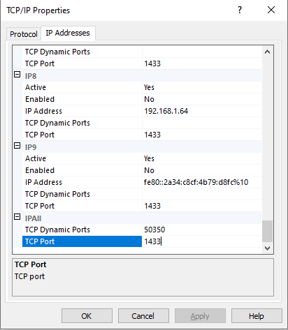
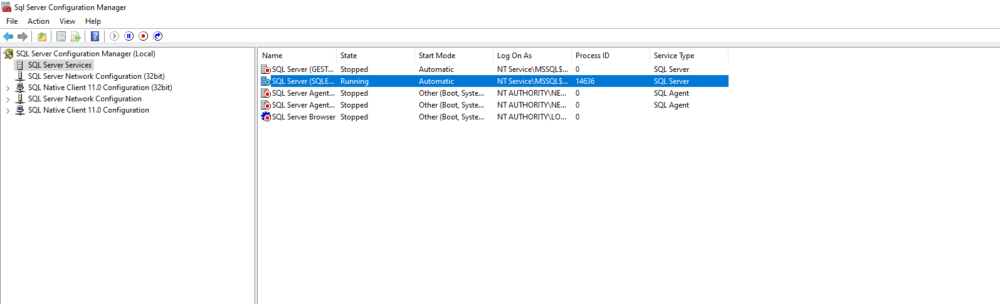

# Instrucciones para la ejecución

1.  Descargar los archivos bd.bacpac y gest.jar.

2.  Importar la base de datos en Microsoft SQL Server haciendo uso del archivo bd.bacpac como se muestra en el siguiente tutorial:
    [Tutorial para importar la base de datos a Microsoft SQL Server](https://youtu.be/XLzV_gagkZc?t=182)
    
    **Nota: La base de datos debe ser guardada con el nombre "gestorContrasenias"** 
3.  Ejecutar el siguiente script en el gestor de base de datos:

    ```
    USE [master]
    GO

    DROP LOGIN [gestCont]
    GO

    CREATE LOGIN [gestCont] WITH PASSWORD='gestContConQuesoDeCabra123', DEFAULT_DATABASE=[master], DEFAULT_LANGUAGE=[us_english], CHECK_EXPIRATION=OFF, CHECK_POLICY=ON
    GO


    USE [gestorContrasenias]
    GO


    DROP USER [gestCont]
    GO


    CREATE USER [gestCont] FOR LOGIN [gestCont] WITH DEFAULT_SCHEMA=[dbo]
    GO

    GRANT EXECUTE ON [dbo].[RegUsr] TO [gestCont]
    GRANT EXECUTE ON [dbo].[CompUsrExist] TO [gestCont]
    GRANT DELETE ON [dbo].[CUENTA] TO [gestCont]
    GRANT INSERT ON [dbo].[CUENTA] TO [gestCont]
    GRANT SELECT ON [dbo].[CUENTA] TO [gestCont]
    GRANT UPDATE ON [dbo].[CUENTA] TO [gestCont]
    GRANT INSERT ON [dbo].[USUARIO] TO [gestCont]
    GRANT SELECT ON [dbo].[USUARIO] TO [gestCont]
    GRANT DELETE ON [dbo].[FOLDER] TO [gestCont]
    GRANT INSERT ON [dbo].[FOLDER] TO [gestCont]
    GRANT SELECT ON [dbo].[FOLDER] TO [gestCont]
    GRANT UPDATE ON [dbo].[FOLDER] TO [gestCont]

    EXEC sp_change_users_login 'Update_One', 'gestCont', 'gestCont'
    GO
    ```

4. Establecer la autenticación del servidor de base de datos a "SQL Server and Windows Authentication mode" desde SQL Server.

    1. Seleccionar el servidor de base de datos.
    <div align = "center"></div>
    2. Ingresar a la ventana de propiedades y dirigirse a seguridad para realizar el cambio.
    <div align = "center"></div>

5. Configuración de la conexión al servidor de base de datos desde SQL Server Configuration Manager.
    
    1. Habilitar el protocolo TCP/IP para el servidor de base de datos.
    
        1. Seleccionar el servidor de base de datos.
        <div align = "center"></div>

        2. Ingresar a la ventana de propiedades TCP/IP y establecer Enabled a "yes".

        <div align = "center"></div>

    2. Configurar los puertos de comunicación del servidor en la ventana de propiedades TCP/IP ingresar a la pestaña "Ip Addresses".

        <div align = "center"></div>

        1. Establecer el campo "TCP Dynamic Ports" en blanco.

        <div align = "center"></div>

        2. Establecer el puerto TCP de cada IP con 1433 en la parte inferior de la ventana.

        <div align = "center"></div>

6. Reiniciar el servidor de base de datos.

    1. Seleccionar el servidor en la pestaña de SQL Server Services, dar click derecho al servidor y reiniciar.

        <div align = "center"></div>

7. Ejecutar el archivo gest.jar.


